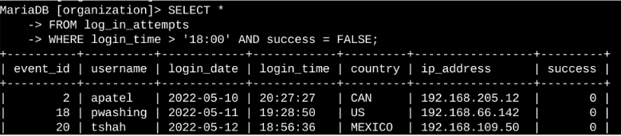
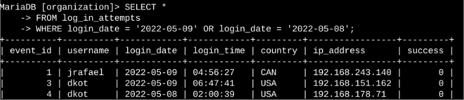
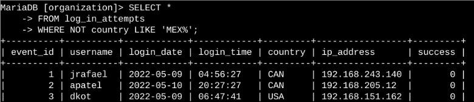
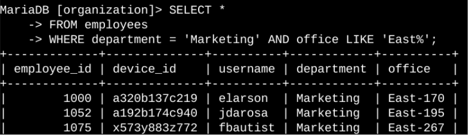

# SQL Project: Apply Filters to Security-Related Queries

## Project Description
My organization is actively working to enhance its system security. As part of the security team, my responsibilities include ensuring system safety, investigating potential security incidents, and managing employee computer updates. 

This project demonstrates how I utilize **SQL with logical filters (AND, OR, NOT, LIKE)** to query databases, isolate specific security events, and extract actionable data to mitigate vulnerabilities.

---

## Task 1: Retrieve After-Hours Failed Login Attempts

### 1. Incident Context
A potential security incident occurred after business hours (after 18:00). To identify unauthorized access attempts, all unsuccessful login events during this timeframe needed to be investigated.

### 2. SQL Query Execution
I queried the `log_in_attempts` table. I applied a `WHERE` clause combining two conditions with the `AND` operator: filtering for times after `18:00` and ensuring the `success` status was `FALSE`.

```sql
SELECT * FROM log_in_attempts 
WHERE login_time > '18:00' 
  AND success = FALSE;
```


Task 2: Retrieve Login Attempts on Specific Dates
1. Incident Context
A suspicious event was detected on 2022-05-09. To trace attacker reconnaissance or lateral movement, any login activity that occurred on that date or the preceding day (2022-05-08) had to be audited.

2. SQL Query Execution
I selected all records from the log_in_attempts table, using a WHERE clause with the OR operator to capture events matching either of the target dates.

```sql
SELECT * FROM log_in_attempts 
WHERE login_date = '2022-05-09' 
   OR login_date = '2022-05-08';
```


Task 3: Retrieve Login Attempts Outside of Mexico
1. Incident Context
After auditing general authentication traffic, a high volume of anomalous login attempts was found originating outside of Mexico. These foreign connections required formal investigation to rule out credential stuffing attacks.

2. SQL Query Execution
In the dataset, Mexico is represented as both MEX and MEXICO. To isolate external traffic, I used the NOT operator combined with LIKE and the wildcard character % to exclude any country code starting with "MEX".

```sql
SELECT * FROM log_in_attempts 
WHERE NOT country LIKE 'MEX%';
```


Task 4: Retrieve Employees in the Marketing Department
1. Incident Context
The IT security team needed to deploy a critical operating system patch and hardware updates for specific machines. The immediate target group was employees belonging to the Marketing department who work in the East building.

2. SQL Query Execution
I switched to the employees table and applied the AND operator to filter rows where the department matched 'Marketing' and the building matched 'East'.

```sql
SELECT * FROM employees 
WHERE department = 'Marketing' 
  AND building = 'East';
```


## Summary & Key Takeaways
Throughout these tasks, I successfully demonstrated the ability to:

Filter complex datasets to pinpoint  critical security incidents using AND / OR logic.

Isolate anomalies by excluding data patterns using NOT and wildcards (% with LIKE).

Efficiently navigate relational tables (log_in_attempts and employees) to assist in incident response and corporate asset management.
